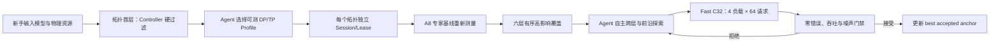

# A8 Fast Agentic V2 自动调优链路

> 历史版本。当前生产入口见 [CURRENT_DEFAULTS.md](CURRENT_DEFAULTS.md)；本文仅用于复现旧 Session。

版本标识：`a8-fast-agentic-v2-20260814`

本版本解决四个相互关联的问题：拓扑不再写死在人的经验里；单轮基准有
10 分钟硬预算；分层搜索在覆盖阶段之后把跨层选择权交给 Agent；新
Session 从已验证的 A8 专家基线开始，而不是从 B0 开始。

## 完整控制链



拓扑、镜像、模型、Benchmark 和搜索空间身份在 Session 内冻结。参数
Controller 永远不能在同一个 Session 中偷换 DP/TP；拓扑比较必须创建独立
Session，以避免把拓扑收益和 serving 参数收益混在一起。

## 1. 拓扑首层

`workflow/continuous/topology_advisor.py` 面向不了解 DP/TP 的使用者。它先
检查物理节点、每节点 NPU 数、执行器契约、模型适配和已有验证证据，只把
通过硬条件的 Profile 交给 Agent。Controller 负责安全和身份冻结，Agent
负责在多个可测 Profile 的同口径指标之间选择最高价值拓扑。

当前 GLM-5.2 W8A8 + 2×16 A3 的结果只有 `a3_dp2_tp16` 可用。DP4/TP8
会让每卡权重分片相对 TP16 近似翻倍，现有镜像没有装载与端到端证据；
DP1/TP32 又缺少跨节点单 TP group 执行器。因此二者以 `planned` 和明确
blocker 保留，系统会自动筛掉，不会让新手为一次必然高风险的实验消耗
32 卡资源。未来模型更小或执行器完成后，只需把对应 Profile 的验证状态
和模型契约升级，不需要改参数 Controller。

新 Session 可显式使用：

```bash
python workflow/continuous/topology_advisor.py --model-contract glm-5.2-w8a8
python workflow/continuous/continuous_tuning.py --topology-profile a3_dp2_tp16
```

## 2. 固定的 10 分钟快速 Benchmark

原 `benchmark-tuning-structured-v4` 保持原样。服务器在各自隔离的
`cjx-workspace` 项目下复制出：

`workflow/auto/vendor/benchmark-tuning-fast-c32-v1`

副本新增 `01_调优_快速筛选-v1.yaml`，身份为 `tuning-fast-c32/v1`，文件
SHA256 为：

`53c15add17634abbffcfff1b3dde183213fbbd0669e832fda59c52e1631d4145`

快速版仍保留四类冻结负载和每类 64 个 C32 正式请求，只移除不参与主评分
的 C1/C16。A8 历史正式 C32 时间为 35.78 + 76.51 + 100.29 + 181.91 =
394.49 秒；计入四个预热 case 和编排开销，目标区间为 7–9 分钟。整个测评
从输入校验开始计时，600 秒后强制失败，不会生成可接受结果。快速配置把
case/runtime/metrics 全矩阵重试设为 0，避免一次测评被隐式拉长；Controller
仍可把失败作为独立 recovery round 处理。

最终 `metrics.json` 顶层直接输出：

- `output_token_throughput`
- `ttft_p50_ms`、`ttft_p90_ms`
- `tpot_p50_ms`、`tpot_p90_ms`
- `benchmark_wall_time_seconds`

`l1.cases` 继续保留每个工作负载的吞吐、TTFT、TPOT 和请求完整性证据。

## 3. Agent 策略

默认策略变为 `hierarchical_agentic_topology_v2`：

0. 拓扑首层（Session 外）。
1. capacity 与 memory geometry。
2. speculative decode/MTP 路径。
3. prefill、KV cache 与 scheduler。
4. compilation 与 graph shape。
5. MoE routing 与 balance。
6. Ascend communication 与 kernels。

前六个参数层是高影响覆盖课程，每层只有 1–2 次有效测量预算，负收益会
提前离层，避免机械穷举。覆盖完成后，Controller 不再返回一个候选层；它
只提供所有层的测量摘要、完整 whitelist、已尝试组合、参数画像、约束和
best accepted anchor。Agent 自主决定下一层或 1–2 参数跨层组合。预算先验
为 65% exploitation、25% 跨层交互、10% frontier novelty，这只是 Agent
决策先验，不是 Controller 的硬候选层选择。

Controller 仍严格负责：完整候选 schema、值白名单、单轮参数数、grid
距离、高风险参数、运行时依赖、重复候选、Benchmark 身份和确定性接受门禁。

## 4. A8 基线与 Search Limits

默认基线是 `a8_glm52_w8a8_expert_fast_v1.yaml`。它固定 completed Session
`cjx_glm52_continuous_20260807_093620/round_009_a8` 的完整参数和证据哈希。
A8 在旧 v4 的 C32 几何平均输出吞吐为 551.271，对应 B0 为 214.982。历史
指标只用于来源证明；由于 fast benchmark 身份不同，新 Session 必须先把
A8 在 fast suite 上重新测一次，不能直接借用旧分数。

默认自动空间从 22 active + 80 reserve 调整为 26 active + 76 reserve。
不是把 102 个可调轴全部暴露给 Agent，而是在保持决策可控的前提下加入：

- `cudagraph_capture_sizes`
- `VLLM_ASCEND_ENABLE_BATCH_MEMCPY`
- `additional_config__ascend_compilation_config__fuse_allreduce_rms`
- `additional_config__prefill_comm_compute_overlap`

实际编译还按影响、风险、类别配额和兼容性从 102 个可调轴中确定 26 个
active；其余 76 个继续保留画像、值域和注入契约，可由后续基于历史证据的
rotation 进入 active。这样比 22 个轴多出人工难覆盖的通信/融合前沿，又不
把 102 维组合爆炸直接交给 Agent。

## 版本与兼容策略

默认组合由新的 runtime Profile 一次性绑定：

- Runtime：`glm52_w8a8_a3_a8_fast_agentic_v2`
- Topology：`a3_dp2_tp16`
- Baseline：`a8_expert_fast_v1`
- Benchmark：`aligned_fast_c32_v1`
- Strategy：`hierarchical_agentic_topology_v2`
- Search Space：`automatic_registry_a8_agentic_v2`

旧 B0、A0、aligned-L1 v4、22/80 automatic registry 和旧分层策略全部保留
为显式可选 Profile。正在运行或已完成的 Session 使用自身冻结的
`session_config.yaml`，不会被新默认污染。切换任意拓扑、Benchmark、基线
或搜索策略必须开新 Session。
