# 架构与数据流

> 当前生产链路是 Decode Priority V3：固定 DP4/TP8、A10F1 专家锚点、
> `automatic_registry_decode_priority_v2`、`decode_priority_agentic_v2` 与
> `decode_only_c32_v2`。通用 Guided-V4/Fast-C32 配置、DP2、旧 A8 Fast/Frontier
> 和 Topology Campaign 都是显式参考路线。当前权威入口见
> [CURRENT_DEFAULTS.md](CURRENT_DEFAULTS.md)。

## 系统边界

项目分为离线知识构建和在线连续调优两条链路。本地 Windows 机器是控制面，`hetao-npu` 是执行入口，ktp-lab 两节点 Lease 是计算面。

```mermaid
flowchart LR
    A["固定提交源码"] --> B["结构化参数提取"]
    B --> C["Stage-1 初筛与迁移"]
    C --> D["ParameterYAML 参数画像"]
    D --> E["五维 Tags"]
    E --> R["场景召回"]
    R --> P["可选：自动注册表 / 人工注册表"]
    P --> F["Search Limits 编译"]
    F --> G["本地 Controller"]
    G --> H["Codex 选参与确定性校验"]
    H --> I["独立 ktp-lab Lease"]
    I --> J["vLLM + Aligned-L1"]
    J --> K["指标、日志和失败证据"]
    K --> G
```



## 离线知识链路

1. 从两个固定提交识别 CLI、配置字段和环境变量等参数表面。
2. 独立覆盖审计确保结构化提取没有已知缺口。
3. Stage-1 按性能相关性、可调性和安全边界初筛。
4. 迁移程序只迁移仍适用于当前源码的旧知识，并记录 A/B/CURRENT_ONLY 分类证据。
5. Codex 为每个候选生成作用、合法值、约束、风险、关联参数和调优建议。
6. 五维 Tags 按硬件、模型、拓扑、场景和优化目标组织检索。

## Search Limits

当前生产 V3 Session 使用独立自动注册表：

```text
340 ParameterYAML
→ 225 场景召回
→ 自动 registry.generated.yaml
→ 142 自动 Registry 参数
→ 100 Tunable：25 Active + 75 Reserve
→ 42 Fixed + 0 Compiler Rejected
```

新 Session 会重新编译并把结果冻结到自身 `00_search_space/`。生产 V2 的
25 个 Active 是：

```text
max_num_seqs
max_model_len
max_num_batched_tokens
gpu_memory_utilization
compilation_mode
num_speculative_tokens
enable_chunked_prefill
async_scheduling
enable_expert_parallel
fused_mc2
enable_balance_scheduling
enable_reduce_sample
speculative_config__enforce_eager
cudagraph_capture_sizes
max_cudagraph_capture_size
TASK_QUEUE_ENABLE
speculative_config__disable_padded_drafter_batch
additional_config__ascend_compilation_config__fuse_allreduce_rms
additional_config__prefill_comm_compute_overlap
additional_config__ascend_compilation_config__enable_static_kernel
additional_config__ascend_compilation_config__enable_npugraph_ex
additional_config__ascend_compilation_config__fuse_norm_quant
enable_prefix_caching
flashcomm1
disable_hybrid_kv_cache_manager
```

`automatic_registry_decode_priority_v2` 从召回画像、固定源码、版本化兼容覆盖和确定性组合约束生成注册表。MTP 深度、CUDAGraph 列表和最大图尺寸由 Agent 选择；在 Full Decode Graph 且有效 SP（显式 `compilation_enable_sp` 或 FlashComm1）生效时，Controller 提交前强制校验 `K+1` 与 TP 必须互相整除，并校验归一化后的图列表至少保留一个 TP 倍数、图上限与 scheduler budget。历史只有在 Benchmark、镜像、源码和完整拓扑身份均匹配时才能导入。通用 `automatic_registry_a8_frontier_v4`、人工 `curated_registry_v1` 和休眠 Topology Campaign 仍可显式选择，但不介入生产 V2。

探索预算按成功测量轮的实际候选参数差异计数，不读取该轮结束后为下一轮生成的 Agent 决策。负收益分支回到 `best_accepted_anchor` 只更新 Controller 状态，不消耗探索配额，也不重复提交 Benchmark；从该锚点提出的新变化才计入参数数目和网格步长。Session 停止时写出 `final_selection.json`，并把历史最优已接受候选固化为最终配置，同时保留最后测量轮用于审计。

Decode Priority 策略不再为 List 1.2/List 1.1 次级参数设置成功测量总配额。Agent 可在跨层阶段自主回访，也可在有明确耦合依据时把次级参数作为当前有序层的 companion；有序层本身仍必须至少包含一个层内变化。该开放只移除探索治理限制，不绕过候选值域、完整配置不变量、确定性非法组合过滤和重复失败候选隔离。

生产 V2 当前 Controller 冻结结果为：100 Tunable（25 Active + 75 Reserve）→ 42 Fixed + 0 Compiler Rejected。硬失败按完整组合隔离，不再全局删除单值。

当前正式 decode-only 自治任务由 `workflow/continuous/server_autonomous/config.dp4_tp8.decode_priority_v3.yaml` 显式固定：DP4/TP8 runtime、A10F1 基线、`automatic_registry_decode_priority_v2`、`decode_priority_agentic_v2`、`decode_only_c32_v2` 和 V3 历史种子。V2 Benchmark移除无效串行长预热，同服务执行3次C32正式测量并取中位数；旧口径指标不得参与新Session判优。

历史驱动轮换只接受 Benchmark 定义、镜像 Digest 和两个源码 commit 全部一致的 Session；不匹配的历史与上一版选择会失败关闭。

`enable_eplb=false` 与 `eplb_num_redundant_experts=0` 是固定运行契约，不是搜索轴。当前 pinned Ascend 平台不支持上游 `--enable-eplb` CLI。

## 在线状态机

- 当前生产 V3 从 A10F1 重新测量并建立本 Session 基线；旧 A8/B0 只作历史对照。
- Codex 从最佳已验收锚点出发提出候选。
- 第一层使用画像和关系证据判断候选是否合理。
- 第二层由 Python 强制执行白名单、参数组合、网格预算、重复候选和历史隔离。
- 通过后把完整候选转换为环境变量和 vLLM 命令。
- 远端成功启动服务后才允许 Benchmark。
- 指标必须通过请求完整性、Token 形状、吞吐和 TTFT/TPOT 门禁。
- 参数 OOM/非法值可以最小化修正；基础设施故障只允许同候选有限重试；未知问题暂停人工处理。

资源执行层通过独立边界接入。默认 `ktp_lab` 继续走已验证的内置路径；新 Session
可以显式加载 Executor Adapter v1，将 `prepare/check_ready/submit/snapshot/stop/
wait_for_release` 映射到其他调度器。外部适配器不能修改候选、Session 或指标判定，
其文件与配置身份随 Session 冻结。拓扑 Executor Profile 约束 rank/进程布局，
Executor Adapter 负责资源管理；两者不能互相冒充。

## 本地与远端隔离

新项目使用：

```text
Lease: vllmtkb-418bd627-32c8cf190-glm52-a3-32npu
Remote: /mnt/host-model/slai/user-1-wangakang/wangakang/cjx-workspace/vllmtkb-418bd627-32c8cf190
```

Controller 的状态、锁、停止标记和实验目录都位于本项目内部，不与 `vllmTKB0706` 共用。
