# 架构与数据流

## 系统边界

项目分为离线知识构建和在线连续调优两条链路。本地 Windows 机器是控制面，`hetao-npu` 是执行入口，ktp-lab 两节点 Lease 是计算面。

```mermaid
flowchart LR
    A["固定提交源码"] --> B["结构化参数提取"]
    B --> C["Stage-1 初筛与迁移"]
    C --> D["ParameterYAML 参数画像"]
    D --> E["五维 Tags"]
    E --> R["场景召回"]
    R --> P["可选：自动注册表 / 人工注册表"]
    P --> F["Search Limits 编译"]
    F --> G["本地 Controller"]
    G --> H["Codex 选参与确定性校验"]
    H --> I["独立 ktp-lab Lease"]
    I --> J["vLLM + Aligned-L1"]
    J --> K["指标、日志和失败证据"]
    K --> G
```



## 离线知识链路

1. 从两个固定提交识别 CLI、配置字段和环境变量等参数表面。
2. 独立覆盖审计确保结构化提取没有已知缺口。
3. Stage-1 按性能相关性、可调性和安全边界初筛。
4. 迁移程序只迁移仍适用于当前源码的旧知识，并记录 A/B/CURRENT_ONLY 分类证据。
5. Codex 为每个候选生成作用、合法值、约束、风险、关联参数和调优建议。
6. 五维 Tags 按硬件、模型、拓扑、场景和优化目标组织检索。

## Search Limits

新 Session 默认使用人工审计注册表：

```text
340 ParameterYAML
→ 109 场景召回
→ 人工审计 registry.yaml：23 项
→ 16 Tunable：12 Active + 4 Reserve
→ 6 Fixed + 1 Rejected
```

新 Session 会重新编译并把结果冻结到自身 `00_search_space/`。当前 Active 是：

```text
max_num_seqs
max_num_batched_tokens
gpu_memory_utilization
compilation_mode
num_speculative_tokens
enable_chunked_prefill
long_prefill_token_threshold
enable_prefix_caching
cudagraph_capture_sizes
max_cudagraph_capture_size
mlapo
flashcomm1
```

`curated_registry_v1` 是默认值，复用人工审计的 23 项 `registry.yaml`；`automatic_registry_v1` 是可插拔替代选项，不读取人工注册表，而是从召回画像、固定源码和确定性兼容策略生成注册表。两条路径在新 Session 创建时选择并冻结。当前两条路径的 Active 均为 12 项，其中 10 项独立对齐；自动路径额外显式控制 `async_scheduling` 与 `speculative_config__method`，人工路径保留 `enable_chunked_prefill` 与 `long_prefill_token_threshold`。人工路径在 MTP tokens 从 0 变为正数时，把 `async_scheduling=true` 作为派生配套变化，由 Controller 强制校验，不额外计作独立调参轴。

自动替代路径当前结果为：109 召回 → 89 个语义组 → 68 个兼容注册参数 → 28 Tunable（12 Active + 16 Reserve）→ 40 Fixed + 0 Compiler Rejected。

历史驱动轮换只接受 Benchmark 定义、镜像 Digest 和两个源码 commit 全部一致的 Session；不匹配的历史与上一版选择会失败关闭。

`enable_eplb=false` 与 `eplb_num_redundant_experts=0` 是固定运行契约，不是搜索轴。当前 pinned Ascend 平台不支持上游 `--enable-eplb` CLI。

## 在线状态机

- B0 用官方源码默认值建立新 Session 基线；A0 作为历史专家配置基线保留。
- Codex 从最佳已验收锚点出发提出候选。
- 第一层使用画像和关系证据判断候选是否合理。
- 第二层由 Python 强制执行白名单、参数组合、网格预算、重复候选和历史隔离。
- 通过后把完整候选转换为环境变量和 vLLM 命令。
- 远端成功启动服务后才允许 Benchmark。
- 指标必须通过请求完整性、Token 形状、吞吐和 TTFT/TPOT 门禁。
- 参数 OOM/非法值可以最小化修正；基础设施故障只允许同候选有限重试；未知问题暂停人工处理。

## 本地与远端隔离

新项目使用：

```text
Lease: vllmtkb-418bd627-32c8cf190-glm52-a3-32npu
Remote: /mnt/host-model/slai/user-1-wangakang/wangakang/cjx-workspace/vllmtkb-418bd627-32c8cf190
```

Controller 的状态、锁、停止标记和实验目录都位于本项目内部，不与 `vllmTKB0706` 共用。
